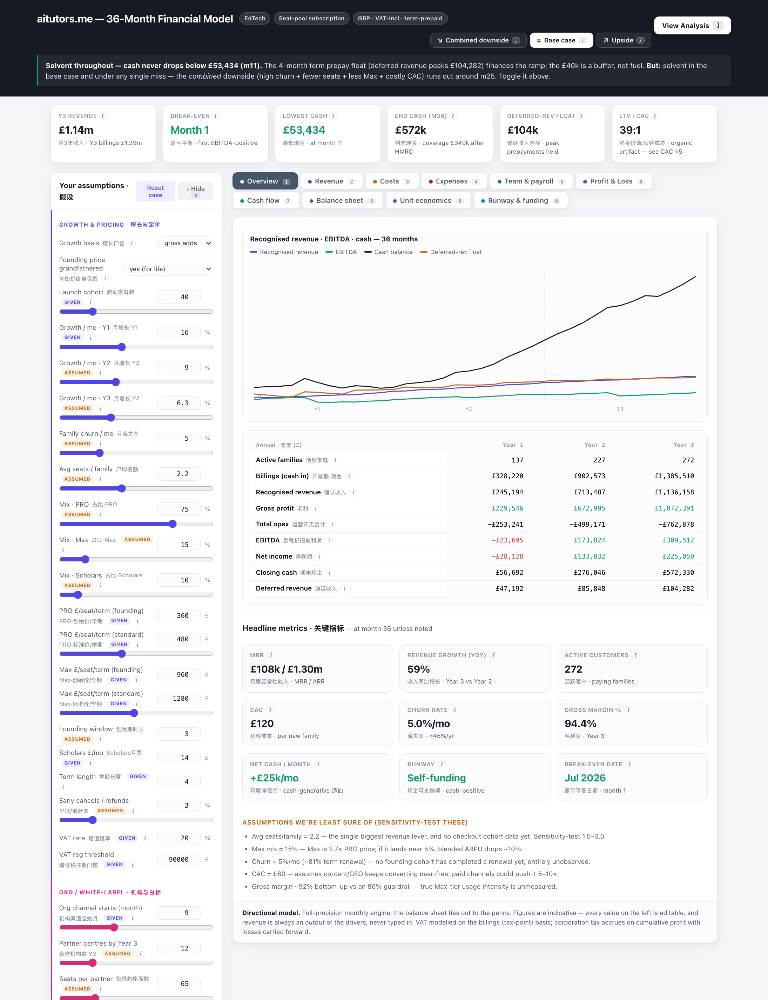
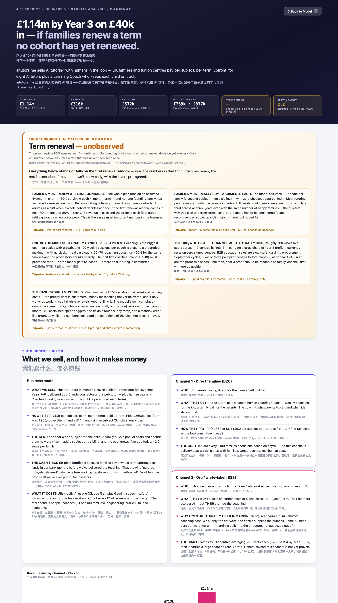

# financial-model-artifact

**Paste a prompt into Claude, answer a short interview, get a live financial model.** Not a spreadsheet. Not an app. A single interactive artifact — model on the front, analysis on the back — built from your business, in your numbers, in a few minutes.

Revenue is never typed in. It's computed from what actually drives it. The balance sheet ties out every month. And a non-finance founder can read the whole thing.

<p align="center">
  <br>
  <em>The model — every driver editable on the left; the whole 36-month model recomputes across ten sheets.</em>
</p>

<p align="center">
  <br>
  <em>Flip the page over → a plain-English analysis: the one number that matters, red flags, benchmarks, and a bottom-line verdict.</em>
</p>

> The screenshots above are a real model generated by this prompt. Yours is built from *your* business, in *your* numbers.

---

## Quickstart

Paste [`PROMPT.md`](PROMPT.md) into a fresh **Claude**, **Claude Code**, or **Codex** session and say:

> **"build my financial model"**

It interviews you for a few minutes — what you sell, what drives revenue, your team, your costs, your funding — then generates a live interactive HTML artifact you can steer with sliders. That's the whole product. No install, no deploy, no database.

Prefer a slash command? [Install it as a Claude Code skill](#use-it-as-a-claude-code-skill) and run `/financial-model`.

## What you get

One self-contained HTML artifact with two sides:

**The model (front)**
- A **headline KPI strip** — Y3 revenue, break-even month, lowest cash, runway, LTV:CAC, burn multiple.
- An **editable assumptions panel** — every driver as a slider or number input, grouped and tagged **GIVEN** (you told us) vs **ASSUMED** (a preset filled the gap), each with a plain-English hover explainer. Change anything; the whole model recomputes instantly.
- **Ten sheets** as month-by-month tables: Overview · Revenue · Costs · Expenses · Team/Payroll · P&L · Cash flow · Balance sheet · Unit economics · Runway. Trend sparklines, in-cell magnitude bars, red negatives, emphasised subtotals.
- **Scenarios** — Base / Best / Worst, toggled live; the overview chart shows all three at once.

**The analysis (flip the page over)**
- A plain-English readout of your **business model** and **growth engine**.
- A **red-flags** section — the honest list a skeptic would raise, derived from *your* computed numbers and severity-tagged.
- A **sector-benchmark check** — your growth, churn, margin, LTV:CAC and payback against typical ranges, chip-scored.
- A **bottom-line verdict** and a "what has to be true" list.

Under all of it: a real three-statement engine — P&L, cash flow (indirect method), and a **balance sheet that ties out to the penny every month.** That tie-out is the model's built-in lie detector. If it balances, the accounting is internally consistent. If it doesn't, the model tells you it's wrong.

## How it works

There's nothing to run. `PROMPT.md` is a prompt, not a program — it instructs the agent to interview you and then write a single HTML file that Claude renders as an **Artifact**. All the CSS and JS are inline; there are no external calls (Artifacts block them). The model lives entirely in that one file. Download it, share the link, or paste the prompt again tomorrow with different answers.

The engine is a single pure `computeModel(assumptions)` over 36 months. Every edit re-runs it from scratch — no stored state, no stale cells. That's why moving a slider updates all ten sheets at once.

## Use it as a Claude Code skill

Drop the skill into your Claude Code skills directory so you can invoke it by name:

```bash
# clone, then copy the skill into your Claude Code skills folder
git clone https://github.com/torlyai/financial-model-artifact
cp -r financial-model-artifact/skills/financial-model ~/.claude/skills/
```

Then in any session:

```
/financial-model
```

The skill is a thin wrapper around [`PROMPT.md`](PROMPT.md) — same interview, same artifact.

## Going further → TorlyAI

This repo is the free scratchpad tier: one prompt, one artifact, ephemeral. Perfect for a first pass, a pitch-deck appendix, or a gut-check before you build.

When you want the model to *persist* — saved scenarios you can revisit, versioned assumptions, a team that can edit the same model, exports, and a real assessment rather than a self-drawn benchmark — that's **[TorlyAI](https://torly.ai)**. Same philosophy (revenue is an output, the balance sheet ties out), with the durability and rigour a funding conversation needs.

Use this to think fast. Move to TorlyAI when the model needs to stick.

## Philosophy

- **Revenue is an output, never an input.** Nobody knows their revenue — they know their drivers. Ask what moves the number (customers, price, growth, churn), then compute the number. A model you can type your hoped-for revenue into is a wish, not a model.
- **The balance sheet must tie out.** Every month, `assets = liabilities + equity`. This isn't accounting pedantry — it's the one check that proves the three statements are consistent with each other. If the model can't tie, it can't be trusted.
- **Readable beats sophisticated.** A founder who can't read their own model can't defend it. Plain labels, hover explainers, visible red flags, an analysis page that talks in English. Rigour underneath, clarity on top.

## License

[MIT](LICENSE). Free forever.

## Credits

Built by **[TorlyAI](https://torly.ai)**. Agent-native, artifact-first financial modelling for founders and the people who build with them.
