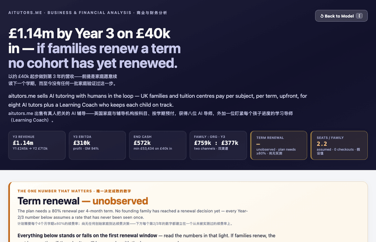
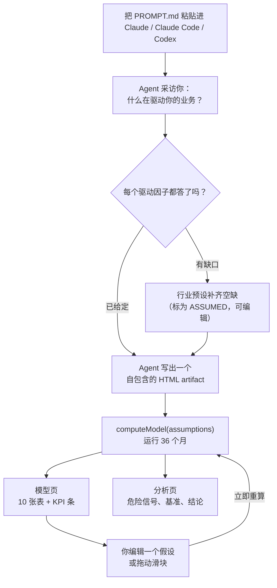
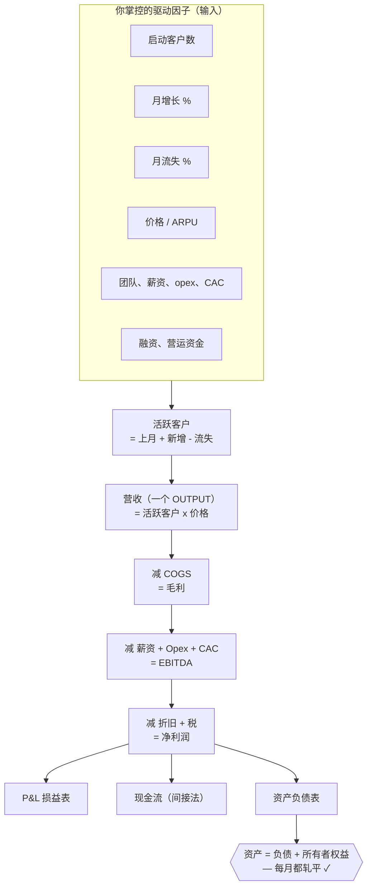

# financial-model-artifact

[English](README.md) · **简体中文**

**把一段 prompt 粘贴进 Claude，回答几个问题，即可得到一个实时财务模型。** 不是电子表格，也不是应用。一个可交互的 artifact——正面是模型，翻面是分析——由你的业务、你的数字生成，几分钟即成。

营收从不手动填入。它由真正驱动它的因子算出。资产负债表每个月都轧平。而且，一位没有财务背景的创始人也能读懂全部内容。

<p align="center">
  <br>
  <em>一个 artifact，两面——从模型翻到分析。</em>
</p>

<p align="center">
  <br>
  <em>模型——左侧每个驱动因子都可编辑；整个 36 个月模型在十张表间实时重算。</em>
</p>

<p align="center">
  <br>
  <em>翻到背面 → 一份大白话分析：唯一决定成败的数字、危险信号、行业基准，以及最终结论。</em>
</p>

> 上方截图是本 prompt 生成的一个真实模型。你的模型，将由 *你的* 业务、*你的* 数字生成。

---

## 快速开始

把 [`PROMPT.md`](PROMPT.md) 粘贴进一个全新的 **Claude**、**Claude Code** 或 **Codex** 会话，然后说：

> **“build my financial model”**（帮我搭建财务模型）

它会用几分钟采访你——你卖什么、什么驱动营收、你的团队、成本、融资——随后生成一个可用滑块调节的实时可交互 HTML artifact。这就是全部产品。无需安装、无需部署、无需数据库。

想用斜杠命令？见下方「把它当作 Claude Code skill 使用」，运行 `/financial-model`。

## 你会得到什么

一个自包含的 HTML artifact，分为两面：

**模型（正面）**
- 一条 **头部 KPI 条**——第 3 年营收、盈亏平衡月份、最低现金、可支撑期（runway）、LTV:CAC、净烧钱倍数（burn multiple）。
- 一个 **可编辑的假设面板**——每个驱动因子都是滑块或数字输入框，分组并标注 **GIVEN**（你给定的）与 **ASSUMED**（预设值补齐的），每项都有大白话悬停说明。改动任意一项，整个模型立即重算。
- **十张表**，逐月呈现：Overview（总览）· Revenue（收入）· Costs（成本）· Expenses（开支）· Team/Payroll（团队/薪资）· P&L（损益）· Cash flow（现金流）· Balance sheet（资产负债表）· Unit economics（单位经济）· Runway（现金跑道）。带趋势 sparkline、单元格内数量条、红色负数、加粗小计。
- **情景（Scenarios）**——Base / Best / Worst（基准/乐观/悲观）实时切换；总览图同时显示三条曲线。

**分析（翻到背面）**
- 对你的 **商业模式** 与 **增长引擎** 的大白话解读。
- 一段 **危险信号（red flags）**——怀疑者会提出的诚实清单，由你算出的数字推导并按严重程度标注。
- 一份 **行业基准对照**——你的增长、流失、毛利、LTV:CAC 与回收期，对比常见区间并给出评级。
- 一个 **最终结论** 与一份「成立前提」清单。

贯穿其下：一套真正的三张报表引擎——P&L、现金流（间接法），以及一张 **每个月都精确轧平到分的资产负债表**。这个轧平是模型自带的测谎仪：能轧平，说明账务内部自洽；轧不平，模型会告诉你它错了。

## 它如何运作

没有任何要运行的东西。`PROMPT.md` 是一段 prompt，不是程序——它指示 agent 采访你，然后写出一个由 Claude 渲染为 **Artifact** 的单个 HTML 文件。所有 CSS 与 JS 都内联；没有任何外部请求（Artifact 会拦截它们）。整个模型就活在那一个文件里。你可以下载它、分享链接，或明天换一组答案再粘一次 prompt。

引擎是一个纯函数 `computeModel(assumptions)`，覆盖 36 个月。每次编辑都从头重算——不存中间状态，没有过期单元格。这就是为什么拖动一个滑块，十张表会同时更新。

### 工作流



### 业务逻辑（数字为何会变）

营收从不手动填入——它由驱动因子算出，再流经三张报表，而资产负债表必须轧平。



改动左侧任意驱动因子，整条链路都会重算；一旦轧平被打破，模型就会告诉你账务出错了。

## 把它当作 Claude Code skill 使用

把 skill 放进你的 Claude Code skills 目录，即可按名调用：

```bash
# 克隆后，把 skill 复制到你的 Claude Code skills 目录
git clone https://github.com/torlyai/financial-model-artifact
cp -r financial-model-artifact/skills/financial-model ~/.claude/skills/
```

随后在任意会话中：

```
/financial-model
```

这个 skill 只是对 [`PROMPT.md`](PROMPT.md) 的一层薄封装——相同的采访，相同的 artifact。

## 更进一步 → TorlyAI

本仓库是免费的「速记本」层：一段 prompt、一个 artifact、用完即弃。适合第一版、pitch deck 附录，或动手前的快速自检。

当你希望模型能 *留存* 下来——可回看的已存情景、带版本的假设、团队协同编辑同一个模型、导出，以及一份真正的评估（而非自画的基准）——那就是 **[TorlyAI](https://torly.ai)**。相同的理念（营收是输出、资产负债表轧平），并具备一次融资对话所需的持久性与严谨度。

→ **[torly.ai/financial-model](https://torly.ai/financial-model/)** &nbsp;·&nbsp; 中文：**[torly.ai/zh/financial-model](https://torly.ai/zh/financial-model/)**

用它快速思考；当模型需要「留得住」时，转向 TorlyAI。

## 理念

- **营收是输出，绝不是输入。** 没人真的知道自己的营收——他们知道的是驱动因子。问清楚什么在推动这个数字（客户、价格、增长、流失），再把数字算出来。一个能让你直接填入「期望营收」的模型，是愿望，不是模型。
- **资产负债表必须轧平。** 每个月，`资产 = 负债 + 所有者权益`。这不是会计上的吹毛求疵——它是唯一能证明三张报表彼此自洽的检查。模型若轧不平，就不可信。
- **可读，胜过高深。** 读不懂自己模型的创始人，没法为它辩护。朴素的标签、悬停说明、显眼的危险信号，以及一页用大白话讲话的分析。底层严谨，表层清晰。

## 许可证

[MIT](LICENSE)。永久免费。

## 关于

由 **[TorlyAI](https://torly.ai)** 打造。为创始人以及与他们并肩构建的人而生的 agent-native、artifact-first 财务建模。
